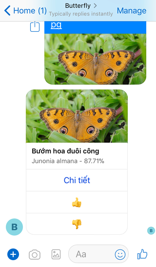

# butterfly-vn

a [Messenger bot](http://m.me/448406622607210) try to predict Butterfly [Species](https://github.com/tentamen/butterfly-vn/blob/master/knowledge/dinh_nghia.md) from photo user submitted.

- Deep Learning retrain via pre-trained Inception v3 model.
- Data stats: [r.txt](r.txt)



## Development
```sh
$ clj -m www
```

## Deployment
```sh
# build uberjar
$ clojure -A:depstar -m hf.depstar.uberjar butterfly.jar
# to cloud run
$ gcloud builds submit -t gcr.io/PROJECT-ID/butterfly:20190709
$ gcloud beta run deploy --image gcr.io/PROJECT-ID/butterfly:20190709 --platform managed
```
